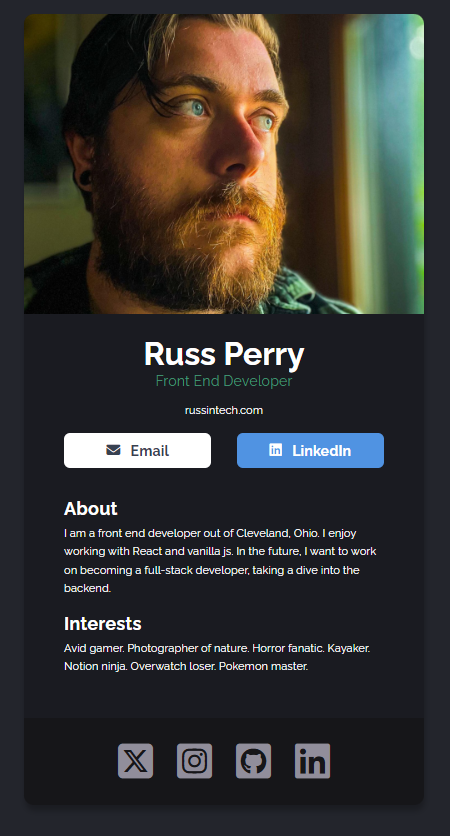

    

# Solo Project 1 - Digital Business Card

As part of the [YouTube Scrimba course on React](https://www.youtube.com/watch?v=bMknfKXIFA8), this was the first "solo" project, where I had no guidance on how to make this project. The course provided a Figma file of the business card, and I tailored it to me.

I probably went overboard on the organization of this project. I split every piece into it's own component, as well as having a separate CSS file for each component. Obviously, this project is really small, but I just wanted to get some practice with having multiple components into a single project. Normally, a project like this, I probably wouldn't even use react for, and just have a single HTML and CSS file. This project wouldn't even really require any JS.

# Links

- [Live Demo](https://rperry99.github.io/solo-01_digital-business-card/)
- [My FreeCodeCamp Course Progress Repo](https://github.com/rperry99/FreeCodeCamp-React)

### React + Vite

This template provides a minimal setup to get React working in Vite with HMR and some ESLint rules.

Currently, two official plugins are available:

- [@vitejs/plugin-react](https://github.com/vitejs/vite-plugin-react/blob/main/packages/plugin-react/README.md) uses [Babel](https://babeljs.io/) for Fast Refresh
- [@vitejs/plugin-react-swc](https://github.com/vitejs/vite-plugin-react-swc) uses [SWC](https://swc.rs/) for Fast Refresh
